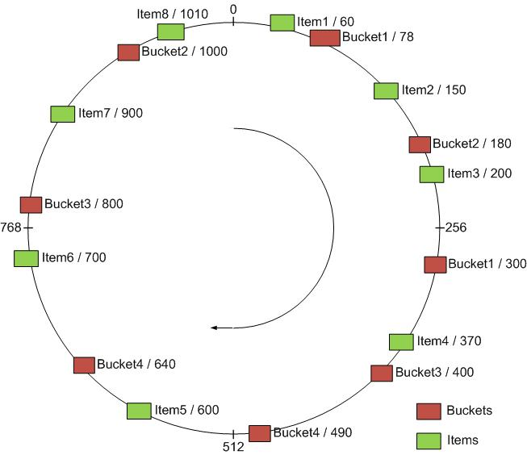

# Consistent Hashing

### What is it?
consistent hashing is a special kind of hashing such that when a hash table is resized, only **K/n** keys need to be remapped on average, where **K** is the number of keys, and **n** is the number of slots

### It is useful because...
A common way of load balancing **n** cache machines is to put object **o** in cache machine number **K % n**. But this will not work if a cache machine is added or removed because **n** changes and every object is hashed to a new location.

Consistent hashing maps objects to the same cache machine, as far as possible. It means when a cache machine is added, it takes its share of objects from all the other cache machines and when it is removed, its objects are shared between the remaining machines.

The main idea behind the consistent hashing algorithm is to associate each cache with one or more hash value intervals where the interval boundaries are determined by calculating the hash of each cache identifier. (The hash function used to define the intervals does not have to be the same function used to hash the cached values. Only the range of the two functions need match.) If the cache is removed its interval is taken over by a cache with an adjacent interval. All the remaining caches are unchanged.

### How it works
1. Map each object to a point on the edge of a circle.
2. Map each machine to pseudo-randomly distributed points on the edge of the same circle.
3. To find the object, we start from the location of the object and walks around till the first machine is found.
4. If a machine becomes unavailable, the objects will needed to be mapped to the next available machine. Items mapped to the lost machine will have to be re-distributed,
5. If a machine is added, we need to move the objects before that machine on the circle.

#### Sources
* [Wikipedia](https://en.wikipedia.org/wiki/Consistent_hashing)
* [Microsoft](https://blogs.msdn.microsoft.com/csliu/2009/09/17/consistent-hashing-theory-implementation/)
